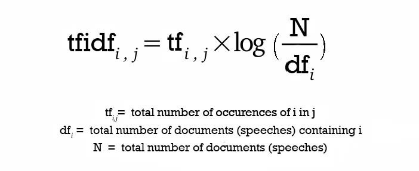

# SCIVER

## SCIVER: Verifying Scientific Claims with Evidence

A feladatunk egy olyan rendszer létrehozása volt, ami tudományos állításokat vizsgál és meghatározza, hogy az állítást a cikkek közül valamelyik alátámasztja-e, avagy ellentmond-e neki.
1. A rendszer egy tudományos állítást vár bemenetként
2. Minden releváns absztarktot azonosít egy nagy korpuszból
3. Címkézi az állításokat az alapján, hogy a releváns absztrakt alátámasztja-e (SUPPORT) vagy ellentmond-e (CONTRADICT) neki
4. Kiválasztja azokat a mondatokat, amik bizonyítják a címke helyességét

## Tervezet

- [x] Adatok előfeldolgozása
- [x] Releváns absztraktok kinyerésére alkalmas módszer keresése (TF-IDF algoritmus)
- [x] Releváns absztraktok kinyerése a korpuszból
- [x] Egy olyan gépi tanulási technika keresése, ami alkalmas mondatok összehasonlítására (Sentence-BERT)
- [x] A Sentence-BERT alkalmazása a feladat megoldására
- [x] A rendszer pontosságának ellenőrzése
- [ ] A rendszer tanítása a kapott tanító halmazzal
- [ ] A rendszer kipróbálása teszt adatokon
- [ ] A rendszer optimalizálása

## Módszerek
### TF-IDF: term frequency–inverse document frequency
A TF-IDF visszaad egy értéket, ami meghatározza, hogy egy kifejezés mennyire fontos a dokumentumok halmazában. Ezt az algoritmust használtuk arra a feladatra, hogy visszaadja a *k* legrelevánsabb absztraktot minden állításhoz.

### Sentence-BERT
A Sentence-BERT a BERT egy módosított variációja, ami sziámi és hármas-szerkezetű (triplet) neurális hálózatot használ ahhoz, hogy össze tudjon hasonlítani mondatokat koszinusz hasonlóság (cosine-similarity) alapján. Ez a módszer jelentősen redukálja azt az időt, ami alatt megtalálja a hasonló mondatokat a BERT-hez képest, míg hasonló pontossággal rendelkezik. A Sentence-BERT segítségével valósítottuk meg a címkézést és a mondatok kiválasztását.

Sentence-BERT működése:

#### Előtanított modellek
Az előtanított modellek közül hármat választottunk ki kipróbálásra. Az SBERT dokumentációja szerint legjobban teljesítőt, ami mpnet alapú és NLI+STSb (Semantic Textual Similarity benchmark) adathalmazon lett tanítva. Ezen kívűl még két másikat, ami Paraphrase Data halmazon lett tanítva, ezek közül az egyik XLM-R, a másik distilroberta alapú.

| Model Name | Base Model | Pooling | Training Data | STSb Performance (Higher = Better) |
| :------: | :------: | :------: | :------: | :------: |
| stsb-mpnet-base-v2 | mpnet-base | Mean Pooling | NLI+STSb | 88,57 |
| paraphrase-xlm-r-multilingual-v1 | XLM-R | Mean Pooling | Paraphrase Data | 83,50 |
| paraphrase-distilroberta-base-v1 | distilroberta-base | Mean Pooling | Paraphrase Data | 81,81 |													

### Küszöbértékek kiválasztása
A címkék küszöbértékét a hasonlóság értékek alapján határoztuk meg. Megnéztük, hogy a SUPPORT és a CONTRADICT körülbelül milyen értéket kaphat egy állítás esetében, ezáltal meghatároztunk két küszöbértéket, majd ezen a választáson az eredmények alapján finomítottunk.

| NOT ENOUGH INFO | CONTRADICT | SUPPORT |
| :------: | :------: | :------: |
| x < 0.45 | 0.45 < x < 0.60 | 0.60 < x |
| x < 0.47 | 0.47 < x < 0.58 | 0.58 < x |
| x < 0.50 | 0.50 < x < 0.58 | 0.58 < x |
| x < 0.52 | 0.52 < x < 0.58 | 0.58 < x |

## Eredmények

A három előtanított modellt 25 állításra próbáltuk ki először, az előzőleg meghatározott küszöbértékekkel, majd ezek közül a legjobban teljesítőt alkalmaztuk az összes állításra. Mindehhez a training és a corpus adathalmazokat használtuk fel, hogy ellenőrizni tudjuk a kapott eredményeket.

Kiértékelés szempontjai:
- Üres Evidence: ahol a kapott Evidence-ben nincs információ / ahol valójában sincs
- Nem üres Evidence : ahol az Evidencben valójában van információ
- True SUPPORT: ami a kapott eredményben SUPPORT / ami valójában SUPPORT
- True CONTRADICT: ami a kapott eredményben CONTRADICT / ami valójában CONTRADICT
- False SUPPORT: ami a kapott eredményben SUPPORT / ami valójában CONTRADICT
- False CONTRADICT: ami a kapott eredményben CONTRADICT / ami valójában SUPPORT
- Eltalált: általunk eltalált / a kipróbált állítások mennyisége
- Pontosság: általunk számított pontosság, a feladat kiírásával ellentétben mi nem csak az egy az egyhez való találatot mérjük, hanem elfogadjuk azt is, amikor a mi predikciónk megtalálható a tanító halmaz predikciójában.

### stsb-mpnet-base-v2

| Küszöbértékek | 0.45/0.60 | 0.47/0.58 | 0.50/0.58 | 0.52/0.58 |
| ------ | :------: | :------: | :------: | :------: |
| **Üres Evidence** | 5/17 | 6/17 | 9/17 | 11/17 |
| **Nem üres Evidence** | 8 | 8 | 8 | 8 |
| **True SUPPORT** | 1/2 | 1/2 | 1/2 | 1/1 |
| **False CONTRADICT** | 1/2 | 1/2 | 1/2 | 0/1 |
| **True CONTRADICT** | 1/1 | 1/1 | 1/1 | 1/1 |
| **False SUPPORT** | 0/1 | 0/1 | 0/1 | 0/1 |
| **Eltalált** | 7/25 | 8/25 | 11/25 | 13/25 |
| **Pontosság** | 0.28 | 0.32 | 0.44 | 0.52 |

### paraphrase-xlm-r-multilingual-v1

| Küszöbértékek | 0.45/0.60 | 0.47/0.58 | 0.50/0.58 | 0.52/0.58 |
| ------ | :------: | :------: | :------: | :------: |
| **Üres Evidence** | 3/17 | 3/17 | 4/17 | 5/17 |
| **Nem üres Evidence** | 8 | 8 | 8 | 8 |
| **True SUPPORT** | 1/2 | 1/2 | 1/2 | 1/2 |
| **False CONTRADICT** | 1/2 | 1/2 | 1/2 | 1/2 |
| **True CONTRADICT** | 2/3 | 2/4 | 1/3 | 1/3 |
| **False SUPPORT** | 1/3 | 2/4 | 2/3 | 2/3 |
| **Eltalált** | 6/25 | 6/25 | 6/25 | 7/25 |
| **Pontosság** | 0.24 | 0.24 | 0.24 | 0.28 |

### paraphrase-distilroberta-base-v1

| Küszöbértékek | 0.45/0.60 | 0.47/0.58 | 0.50/0.58 | 0.52/0.58 |
| ------ | :------: | :------: | :------: | :------: |
| **Üres Evidence** | 5/17 | 5/17 | 7/17 | 8/17 |
| **Nem üres Evidence** | 8 | 8 | 8 | 8 |
| **True SUPPORT** | 1/2 | 1/2 | 1/2 | 1/2 |
| **False CONTRADICT** | 1/2 | 1/2 | 1/2 | 1/2 |
| **True CONTRADICT** | 2/2 | 2/2 | 2/2 | 2/2 |
| **False SUPPORT** | 0/2 | 0/2 | 0/2 | 0/2 |
| **Eltalált** | 8/25 | 8/25 | 10/25 | 11/25 |
| **Pontosság** | 0.32 | 0.32 | 0.40 | 0.44 |

### Eredmény a teljes adathalmazon
Mindezek alapján a legjobb eredményt az stsb-mpnet-base-v2 előtanított modell érte el a 0.52/0.58 küszöbértékekkel, szóval ezt próbáltuk ki a teljes adathalmazra.

| Küszöbértékek | 0.52/0.58 |
| ------ | :------: |
| **Üres Evidence** | 126/304 |
| **Nem üres Evidence** | 505 |
| **True SUPPORT** | 356/631 |
| **False CONTRADICT** | 275/631 |
| **True CONTRADICT** | 143/323 |
| **False SUPPORT** | 180/323 |
| **Eltalált** | 625/809 |
| **Pontosság** | 0.77 |

## Nehézségek:

Fő nehézséget számunkra a határidő jelentette. Nem maradt időnk a tanításra és az utána következő kiértékelésre a saját modellünkkel.
Emellett a kiértékelés kialakítása volt egy nehéz feladat, ami nem sikerült tökéletesre, azonban a választott modellek összehasonlításra és a küszöbértékek finomítására megfelelőnek bizonyult.
